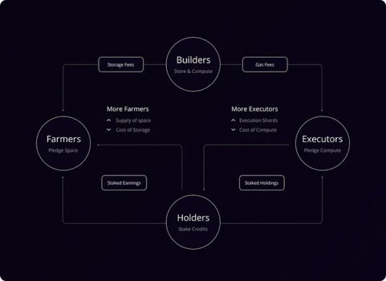

# Developers Guide
---
Subspace is a secure, scalable, decentralized blockchain that resolves blockchain trilemma without making compromises. This guide will cover some of the main aspects of Subspace, if you’re willing to learn more about the technology behind Subspace it’s better to refer to the [Whitepaper - *Full Length*](https://assets.website-files.com/61526a2af87a54e565b0ae92/) or [Whitepaper - *Summarized*](https://subspace.network/news/subspace-network-whitepaper)

## What makes Subspace Network protocol different?
---
New blockchain protocols, designed to be more efficient, fair, and decentralized, are using a system called Proofs-of-Archival-Storage (PoAS) that prioritizes storage-intensive farming over computing-intensive mining. However, this poses a challenge known as the farmer's dilemma, where users must decide whether to allocate their limited storage to maintain the blockchain's state and history, or to use it for consensus building. This may lead to a centralization of farming among a few trusted operators. Subspace, a novel PoC blockchain, resolves this issue by allowing farmers to store the blockchain's history collectively, separating the processes of consensus-building and computation. This results in reduced overheads and facilitates participation by regular users, even in complex execution models.

Decoupled execution keeps farming lightweight and resistant to pooling, while the farmer storage network allows the blockchain to "bloat" massively without becoming centralized.

## What is a Proof-of-Archival-Storage?
---
In Subspace, we define our consensus protocol to be Proof-of-Archival-Storage based on the following:
- A Nakamoto (or longest-chain) consensus protocol
- Employing a proof-of-capacity resource puzzle for space-bound Sybil resistance
- The space reflects some useful storage (as in Proof-of-Replication)
- And the specific data being replicated is the archival history of the Subspace chain

In its simplest form, our Proof-of-Archival-Storage consensus is a 3-phase protocol:
Archiving phase: given new blocks of the chain, construct canonical history.
Plotting phase: given the canonical history of the blockchain, generate a unique replica (the plot) and store it on disk.
Consensus phase: given a challenge from a secure randomness beacon, audit the plot for a solution that satisfies some threshold, return a proof, and propose a block.

If you’re curious to read more about our consensus, [here](https://blog.subspace.network/dilithium-the-subspace-consensus-v2-3c5df0759e72) is the great overview by our researcher Dariia Porechna. 

## A few words about Subspace's protocol **Dilithium**
---
As we transition to our Dilithium v2 consensus, we've recognized the essential role polynomial schemes will play in the next era of blockchain design, just as hash functions, Merkle trees, and ECC signatures did in the previous decade. Subspace is distinctively equipped to utilize these schemes effectively due to our proof-of-archival-storage (PoAS) consensus, which enables a self-regulating feedback loop for storage costs, helping us scale with demand. This enables us to leverage polynomial schemes for linear blockspace scaling proportional to the number of network participants. We specifically employ Reed-Solomon erasure coding and Kate-Zaverucha-Goldberg (KZG) commitments in our v2 consensus, allowing efficient data recovery and authentication.

When archiving the history of Subspace, we replace Merkle roots with KZG commitments. Farmers can then provide constant-sized Kate proofs to clients of the Distributed Storage Network (DSN) as the witness for their pledged archival storage space.
We construct generic proofs-of-replication (PoR) from RS-KZG schemes and extend these into an extremely simple and efficient proof-of-archival-storage (PoAS).

## Is it difficult to build applications on Subspace Network?
---

Our primary objective is to ensure a minimal threshold of entry for both our farmers and developers. The installation of a Subspace Network node can be accomplished in less than 15 minutes, compatible with an extensive array of computer systems, given the highly accessible minimal requirements for the hardware.

When it comes to development on the Subspace Network, we offer versatile options. You can either leverage our core-evm domain for deployment on the EVM, or if preferred, create your own local custom virtual machine. We take pride in the unlimited possibilities we provide - there are absolutely no boundaries!

