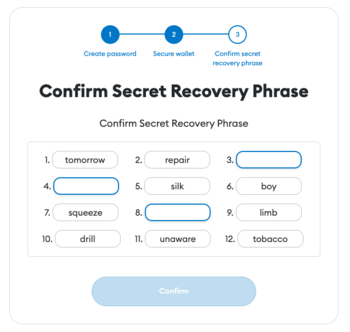

### Adding Subspace RPC using Metamask
---
You can use any EVM-compatible wallet, this guide will be using [**Metamask**](https://metamask.io/) wallet.

First, let’s set up a MetaMask wallet and then go over connecting it to the Subspace Development Network.

1. Go to [Metamask Website](https://metamask.io/) and download an extension for your browser.
   Select your preferred language at the top-right corner. 
   Read and agree to MetaMask terms of use.

  


2. Click on “Create a new wallet”
  Read a note on gathering usage data and either agree to collecting your anonymized data, or skip this step. It would not affect the creation of a wallet. 

  

3. On the next screen you will be asked to create a password. Remember to always set a secure password,  that’s difficult to guess. Type your password twice before proceeding to the next step.

  

4. Metamask automatically assesses the strength of your password. 
  :::tip
  As a rule of thumb, you should set a strong password, meaning that it includes uppercase letters, lowercase letters, numbers and special characters.
  :::

  

5. Watch a video to learn more about Secret Recovery Phrase before processing to the next step. 

  

6. Have a look and write down a 12 word recovery phrase. 
  :::info
  The wallet with the recovery phrase for this guide will be deleted right after the guide is complete.
  ::: 

  

7. Confirm that you’ve written down the recovery phrase by filling in the missing words of your recovery phrase. 

  

8. Now that your wallet is created, let’s connect to the Subspace Core EVM. Click on the Ethereum Mainnet logo and select Add Network.

  

9. At the settings, click on “add a network manually”

  

10. To connect to Subspace RPC, specify domain http, domain id and input token name

  ```
  Network Name: Subspace EVM
  New RPC URL: https://eu-2.evm.gemini-3d.subspace.network/ws
  Chain ID: 1002
  Currency Symbol: TSSC
  ```

You're all set, **you have succesfully configured your MetaMask walle**t and connected it to **Subspace Core EVM**. In order to deploy your smart contract, you first need to get some small amount of **TSSC**  token into your wallet. Please make sure to refer to **Faucet** section of guide to learn more about getting test tokens. 